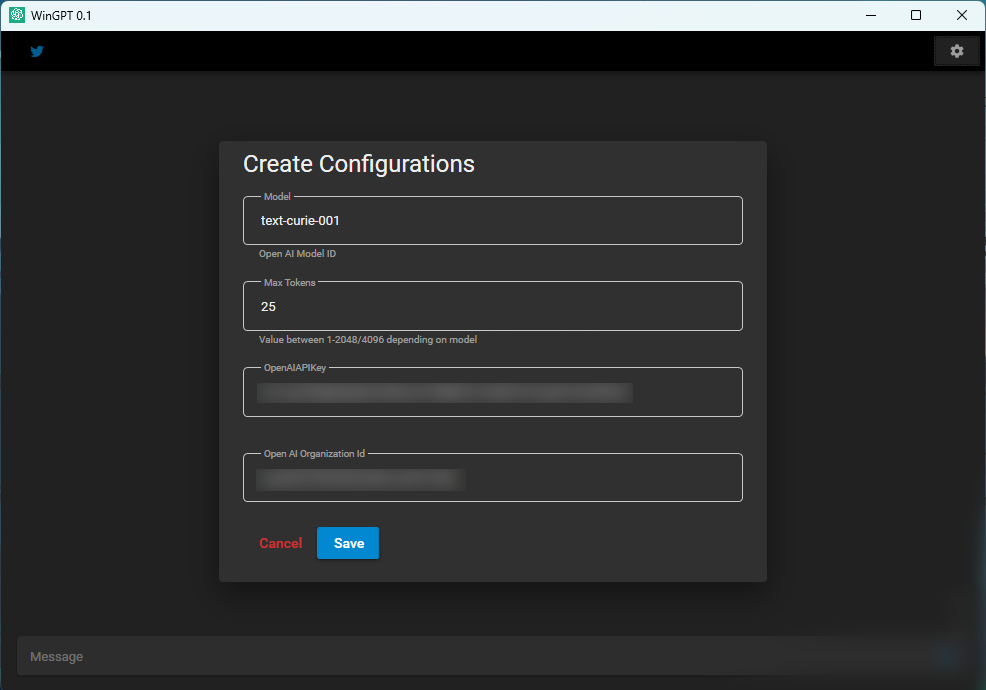
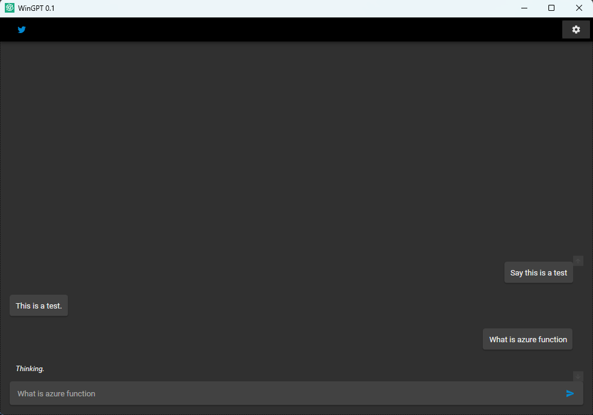
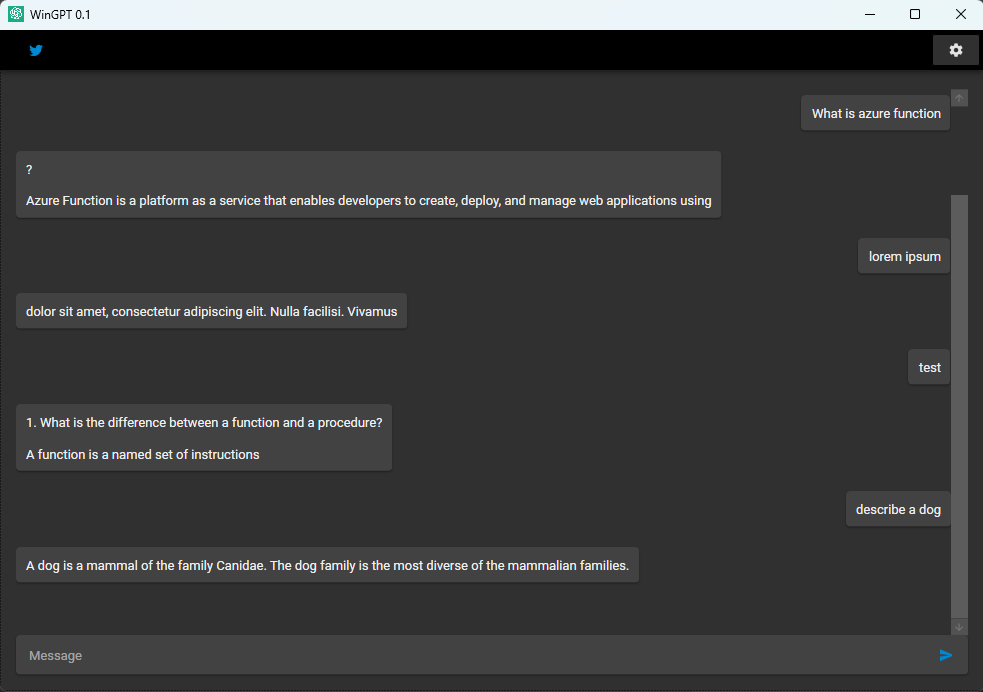

# WinGPT

### Setup the Application
In WinGPT.App open appsettings.json file and set the followin properties
* Model: Completion model to use
* MaxToken: tokens (1-2048/4096) depending on model
* OpenAIAPIKey
* OpenAIOrgId

### App Screenshots

